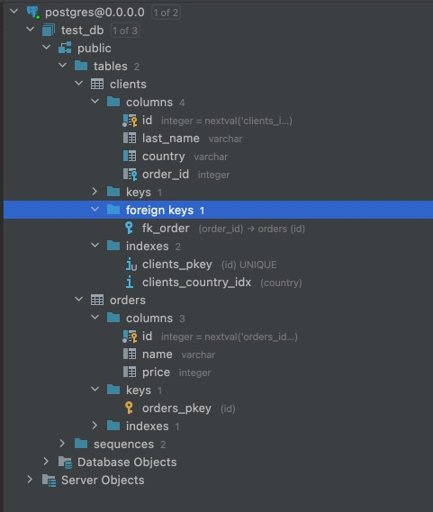
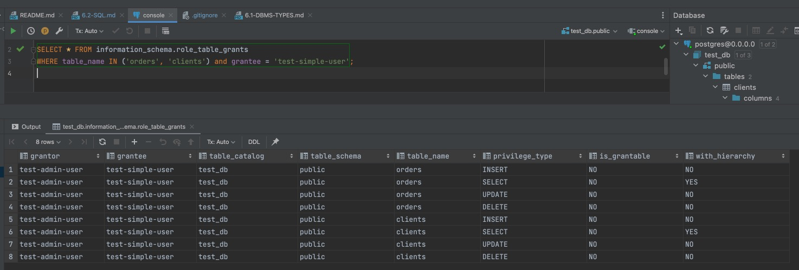

# 6.2. SQL

### Задача 1

Используя docker поднимите инстанс PostgreSQL (версию 12) c 2 volume, в который будут складываться данные БД и бэкапы.

Приведите получившуюся команду или docker-compose манифест.

**Ответ**:

```yaml
version: "1.0"
services:
  postgres:
    image: postgres:12.9
    environment:
      POSTGRES_DB: "test_db"
      POSTGRES_USER: "test-admin-user"
      POSTGRES_PASSWORD: "test"
      PGDATA: "/Users/railsakhaviev/Documents/posgresql/pgdata"
    volumes:
      - /Users/railsakhaviev/Documents/posgresql/pgdata
      - /Users/railsakhaviev/Documents/posgresql/backup
    ports:
      - "5432:5432"
    healthcheck:
      test: ["CMD-SHELL", "pg_isready -U test-admin-user -d test_db"]
      interval: 10s
      timeout: 5s
      retries: 5
      start_period: 10s
    restart: unless-stopped
    deploy:
      resources:
        limits:
          cpus: '1'
          memory: 4G
```

### Задача 2

В БД из задачи 1: 
- создайте пользователя test-admin-user и БД test_db
- в БД test_db создайте таблицу orders и clients (спeцификация таблиц ниже)
- предоставьте привилегии на все операции пользователю test-admin-user на таблицы БД test_db
- создайте пользователя test-simple-user  
- предоставьте пользователю test-simple-user права на SELECT/INSERT/UPDATE/DELETE данных таблиц БД test_db

Таблица orders:
- id (serial primary key)
- наименование (string)
- цена (integer)

Таблица clients:
- id (serial primary key)
- фамилия (string)
- страна проживания (string, index)
- заказ (foreign key orders)

Приведите:
- итоговый список БД после выполнения пунктов выше,
- описание таблиц (describe)
- SQL-запрос для выдачи списка пользователей с правами над таблицами test_db
- список пользователей с правами над таблицами test_db

**Ответ**:

```postgresql
-- Создание таблицы orders:
CREATE TABLE orders (
    id SERIAL,
    name VARCHAR, 
    price INTEGER,
    PRIMARY KEY (id)
);

-- Создание таблицы clients:
CREATE TABLE clients (
    id SERIAL,
    last_name VARCHAR,
    country VARCHAR, 
    order_id INTEGER,
    PRIMARY KEY (id),
    CONSTRAINT fk_order
      FOREIGN KEY(order_id) 
	    REFERENCES orders(id)
);

-- Создание индекса для таблицы clients(country)
CREATE INDEX ON clients(country);

-- Просмотр структуры таблицы orders
SELECT table_name, column_name, data_type FROM information_schema.columns WHERE table_name = 'orders';

-- Просмотр структуры таблицы clients
SELECT table_name, column_name, data_type FROM information_schema.columns WHERE table_name = 'clients';

-- Cоздание пользователя test-simple-user:
CREATE USER "test-simple-user";

-- Даем права пользователю test-simple-user
GRANT CONNECT ON DATABASE test_db TO "test-simple-user";
GRANT USAGE ON SCHEMA public TO "test-simple-user";
GRANT SELECT, INSERT, UPDATE, DELETE ON orders, clients TO "test-simple-user";

-- Проверяем права пользователя test-simple-user к таблицам orders и clients
SELECT * FROM information_schema.role_table_grants WHERE table_name IN ('orders', 'clients') and grantee = 'test-simple-user';

-- Проверяем список пользователей у которых есть права к базе данных test_db
SELECT DISTINCT grantee FROM information_schema.table_privileges where table_catalog = 'test_db'
```

Структура таблицы **test_db**



Запрос и выдача результата со списком прав для пользователя **test-simple-user**



Запрос и выдача результата списка пользователей с доступом к **test_db**


### Задача 3

Используя SQL синтаксис - наполните таблицы следующими тестовыми данными:

Таблица orders

|Наименование|цена|
|------------|----|
|Шоколад| 10 |
|Принтер| 3000 |
|Книга| 500 |
|Монитор| 7000|
|Гитара| 4000|

Таблица clients

|ФИО|Страна проживания|
|------------|----|
|Иванов Иван Иванович| USA |
|Петров Петр Петрович| Canada |
|Иоганн Себастьян Бах| Japan |
|Ронни Джеймс Дио| Russia|
|Ritchie Blackmore| Russia|

Используя SQL синтаксис:
- вычислите количество записей для каждой таблицы 
- приведите в ответе:
    - запросы 
    - результаты их выполнения.

**Ответ**:

```postgresql
-- наполнение таблицы orders тестовыми данными
INSERT INTO orders (name, price) VALUES
('Шоколад', 10),
('Принтер', 3000),
('Книга', 500),
('Монитор', 7000),
('Гитара', 4000);

-- вычисление количества записей для таблицы orders
SELECT COUNT(*) FROM orders; 
-- ответ: 5

-- наполнение таблицы clients тестовыми данными
INSERT INTO clients (last_name, country) VALUES
    ('Иванов Иван Иванович', 'USA'),
    ('Петров Петр Петрович', 'Canada'),
    ('Иоганн Себастьян Бах', 'Japan'),
    ('Ронни Джеймс Дио', 'Russia'),
    ('Ritchie Blackmore', 'Russia');

-- вычисление количества записей для таблицы clients
SELECT COUNT(*) FROM clients;
-- ответ: 5
```

### Задача 4

Часть пользователей из таблицы clients решили оформить заказы из таблицы orders.

Используя foreign keys свяжите записи из таблиц, согласно таблице:

|ФИО|Заказ|
|------------|----|
|Иванов Иван Иванович| Книга |
|Петров Петр Петрович| Монитор |
|Иоганн Себастьян Бах| Гитара |

Приведите SQL-запросы для выполнения данных операций.

Приведите SQL-запрос для выдачи всех пользователей, которые совершили заказ, а также вывод данного запроса.
 
Подсказк - используйте директиву `UPDATE`.

## Задача 5

Получите полную информацию по выполнению запроса выдачи всех пользователей из задачи 4 
(используя директиву EXPLAIN).

Приведите получившийся результат и объясните что значат полученные значения.

## Задача 6

Создайте бэкап БД test_db и поместите его в volume, предназначенный для бэкапов (см. Задачу 1).

Остановите контейнер с PostgreSQL (но не удаляйте volumes).

Поднимите новый пустой контейнер с PostgreSQL.

Восстановите БД test_db в новом контейнере.

Приведите список операций, который вы применяли для бэкапа данных и восстановления. 
