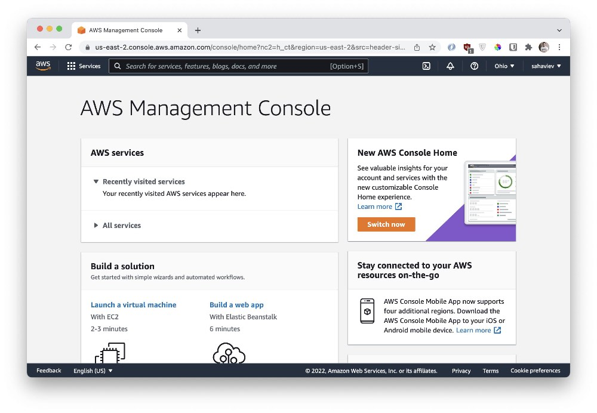
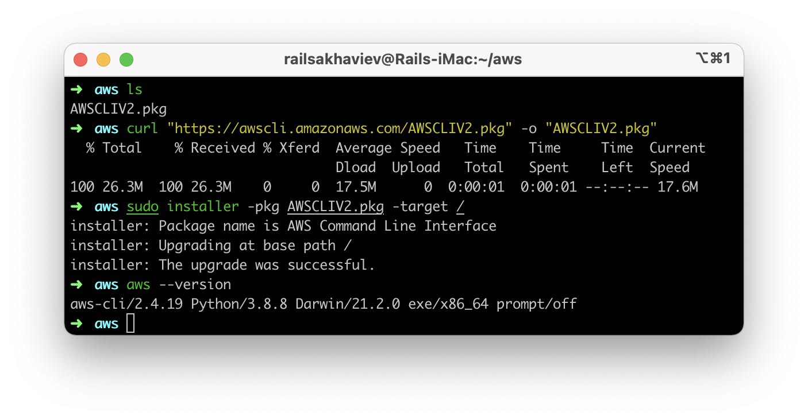
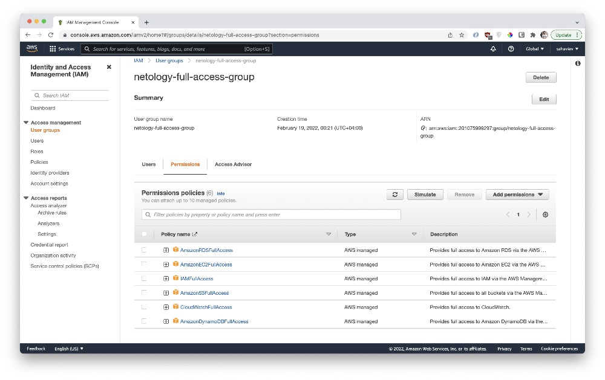

# 7.2. Облачные провайдеры и синтаксис Terraform

## Задача 1. Регистрация в aws и знакомство с основами AWS.

Остальные задания можно будет выполнять и без этого аккаунта, но с ним можно будет увидеть полный цикл процессов. 

AWS предоставляет достаточно много бесплатных ресурсов в первый год после регистрации, подробно описано [здесь](https://aws.amazon.com/free/).
1. Создайте аккаунт aws.
1. Установите c aws-cli https://aws.amazon.com/cli/.
1. Выполните первичную настройку aws-sli https://docs.aws.amazon.com/cli/latest/userguide/cli-configure-quickstart.html.
1. Создайте IAM политику для терраформа c правами
    * AmazonEC2FullAccess
    * AmazonS3FullAccess
    * AmazonDynamoDBFullAccess
    * AmazonRDSFullAccess
    * CloudWatchFullAccess
    * IAMFullAccess
1. Добавьте переменные окружения 
    ```
    export AWS_ACCESS_KEY_ID=(your access key id)
    export AWS_SECRET_ACCESS_KEY=(your secret access key)
    ```
1. Создайте, остановите и удалите ec2 инстанс (любой с пометкой `free tier`) через веб интерфейс. 

В виде результата задания приложите вывод команды `aws configure list`.

---

**Ответ**:

**Аккаунт в AWS**



**Установка AWS.CLI**



**Настройка AWS.CLI**


**Настройка группы с доступами в AWS.IAM**



P.S.: Экспорт переменных окружения с настройками AWS так же добавлены в **.zshrc**.

## Задача 1. Регистрация в Yandex.Cloud и знакомство с основами (необязательно, но крайне желательно).

1. Подробная инструкция на русском языке содержится [здесь](https://cloud.yandex.ru/docs/solutions/infrastructure-management/terraform-quickstart).
2. Обратите внимание на период бесплатного использования после регистрации аккаунта. 
3. Используйте раздел "Подготовьте облако к работе" для регистрации аккаунта. Далее раздел "Настройте провайдер" для подготовки
базового терраформ конфига.
4. Воспользуйтесь [инструкцией](https://registry.terraform.io/providers/yandex-cloud/yandex/latest/docs) на сайте терраформа, что бы 
не указывать авторизационный токен в коде, а терраформ провайдер брал его из переменных окружений.

## Задача 2. Создание aws ec2 через terraform

1. В каталоге `terraform` вашего основного репозитория, который был создан в начале курсе, создайте файл `main.tf` и `versions.tf`.
2. Зарегистрируйте провайдер 
   1. для [aws](https://registry.terraform.io/providers/hashicorp/aws/latest/docs). В файл `main.tf` добавьте
   блок `provider`, а в `versions.tf` блок `terraform` с вложенным блоком `required_providers`. Укажите любой выбранный вами регион 
   внутри блока `provider`.
   2. либо для [yandex.cloud](https://registry.terraform.io/providers/yandex-cloud/yandex/latest/docs). Подробную инструкцию можно найти 
   [здесь](https://cloud.yandex.ru/docs/solutions/infrastructure-management/terraform-quickstart).
3. Внимание! В гит репозиторий нельзя пушить ваши личные ключи доступа к аккаунту. Поэтому в предыдущем задании мы указывали
их в виде переменных окружения. 
4. В файле `main.tf` воспользуйтесь блоком `data "aws_ami` для поиска ami образа последнего Ubuntu.  
5. В файле `main.tf` создайте рессурс 
   1. либо [ec2 instance](https://registry.terraform.io/providers/hashicorp/aws/latest/docs/resources/instance).
   Постарайтесь указать как можно больше параметров для его определения. Минимальный набор параметров указан в первом блоке 
   `Example Usage`, но желательно, указать большее количество параметров.
   2. либо [yandex_compute_image](https://registry.terraform.io/providers/yandex-cloud/yandex/latest/docs/resources/compute_image).
6. Также в случае использования aws:
   1. Добавьте data-блоки `aws_caller_identity` и `aws_region`.
   2. В файл `outputs.tf` поместить блоки `output` с данными об используемых в данный момент: 
       * AWS account ID,
       * AWS user ID,
       * AWS регион, который используется в данный момент, 
       * Приватный IP ec2 инстансы,
       * Идентификатор подсети в которой создан инстанс.  
7. Если вы выполнили первый пункт, то добейтесь того, что бы команда `terraform plan` выполнялась без ошибок. 

В качестве результата задания предоставьте:
1. Ответ на вопрос: при помощи какого инструмента (из разобранных на прошлом занятии) можно создать свой образ ami?
1. Ссылку на репозиторий с исходной конфигурацией терраформа.

--- 
**Ответ**:

С помощью Packer можно создать свой базовый образ операционной системы и отправить его в облако. 
И в дальнейшем на основе его создавать виртуальные машине в terraform указывая в блоке **aws_instance**
поле **ami** = id-образа в облаке.

Ссылка на папку с `tf-файлами` - [terraform/aws](terraform/aws).

1. [terraform/aws/main.tf](terraform/aws/main.tf) - файл с описанием провайдера, AMI-образа на основе которого будет 
собран инстанс, сети, подсети и самого инстанса. 
2. [terraform/aws/outputs.tf](terraform/aws/outputs.tf) - файл с описанием вывода после выполнения **terraform**.
3. [terraform/aws/versions.tf](terraform/aws/versions.tf) - описание необходимых модулей **terraform**.

Результат **terraform apply**:
```terraform
➜  aws git:(master) ✗ terraform apply 

Terraform used the selected providers to generate the following execution plan. Resource actions are indicated with the following symbols:
...
... terraform plan here
...

Do you want to perform these actions?
  Terraform will perform the actions described above.
  Only 'yes' will be accepted to approve.

  Enter a value: yes

aws_vpc.main: Creating...
aws_instance.web: Creating...
aws_vpc.main: Still creating... [10s elapsed]
aws_instance.web: Still creating... [10s elapsed]
aws_vpc.main: Creation complete after 11s [id=vpc-0eb352862b4009e89]
aws_subnet.main: Creating...
aws_subnet.main: Creation complete after 4s [id=subnet-0c93e60c581ef2a7d]
aws_instance.web: Still creating... [20s elapsed]
aws_instance.web: Still creating... [30s elapsed]
aws_instance.web: Still creating... [40s elapsed]
aws_instance.web: Still creating... [50s elapsed]
aws_instance.web: Creation complete after 57s [id=i-08f4aaa525a203eda]

Apply complete! Resources: 3 added, 0 changed, 0 destroyed.

Outputs:

account_id = "201075999297"
caller_user = "AIDAS5UIQIJAVM2VYB5KE"
private_ip = "172.31.22.116"
region = "us-east-1"
subnet_id = "subnet-0c93e60c581ef2a7d"
➜  aws git:(master) ✗ 
```

## Задача 2. Создание yandex_compute_instance через terraform

Для Yandex.Cloud на этот раз я решил использовать 

```commandline
yc compute image list --folder-id standard-images
```
