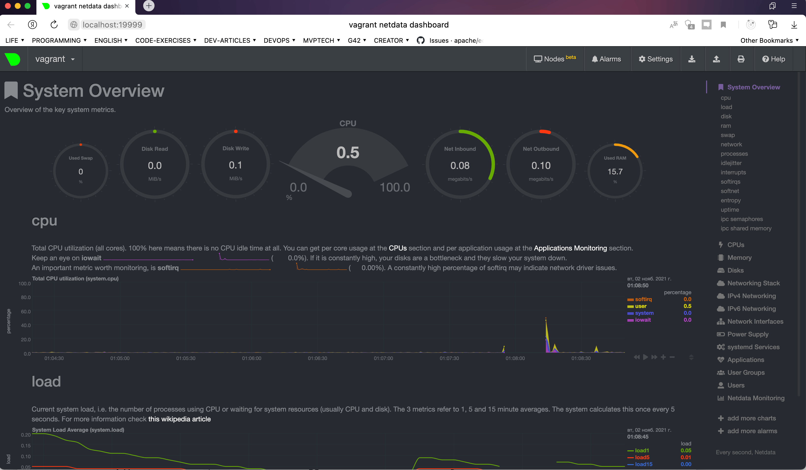

# 3.4. Операционные системы, лекция 2

### 1. На лекции мы познакомились с node_exporter. 
В демонстрации его исполняемый файл запускался в background. Этого достаточно для демо,
но не для настоящей production-системы, где процессы должны находиться под внешним 
управлением. Используя знания из лекции по systemd, создайте самостоятельно простой
unit-файл для node_exporter:

* поместите его в автозагрузку,
* предусмотрите возможность добавления опций к запускаемому процессу через внешний файл (посмотрите, например, на systemctl cat cron),
* удостоверьтесь, что с помощью systemctl процесс корректно стартует, завершается, а после перезагрузки автоматически поднимается.

Установка **node_exporter**:

```commandline
vagrant@vagrant:~$ wget https://github.com/prometheus/node_exporter/releases/download/v1.2.2/node_exporter-1.2.2.linux-amd64.tar.gz
vagrant@vagrant:~$ tar zxvf node_exporter-*.linux-amd64.tar.gz
vagrant@vagrant:~$ cd node_exporter-*.linux-amd64
vagrant@vagrant:~/node_exporter-1.2.2.linux-amd64$ sudo su
root@vagrant:/home/vagrant/node_exporter-1.2.2.linux-amd64# cp node_exporter /usr/local/bin/
```

Создание пользователя **nodeusr**:
```commandline
root@vagrant:/home/vagrant/node_exporter-1.2.2.linux-amd64# useradd --no-create-home --shell /bin/false nodeusr
root@vagrant:/home/vagrant/node_exporter-1.2.2.linux-amd64# chown -R nodeusr:nodeusr /usr/local/bin/node_exporter
```

Создание сервиса(**systemd.service**):
```commandline
root@vagrant:/home/vagrant/node_exporter-1.2.2.linux-amd64# vi /etc/systemd/system/node_exporter.service
```

```commandline
[Unit]
Description=Node Exporter Service
After=network.target

[Service]
User=nodeusr
Group=nodeusr
Type=simple
ExecStart=/usr/local/bin/node_exporter
ExecReload=/bin/kill -HUP $MAINPID
Restart=on-failure

[Install]
WantedBy=multi-user.target
```

Настройка для авто-запуска:

```commandline
root@vagrant:/home/vagrant# systemctl daemon-reload
root@vagrant:/home/vagrant# systemctl enable node_exporter
root@vagrant:/home/vagrant# systemctl start node_exporter
```

Проверка работы node_exporter:

```commandline
root@vagrant:/home/vagrant# curl http://localhost:9100/metrics > node_exporter.txt
  % Total    % Received % Xferd  Average Speed   Time    Time     Time  Current
                                 Dload  Upload   Total   Spent    Left  Speed
100 59789    0 59789    0     0  9731k      0 --:--:-- --:--:-- --:--:-- 9731k
root@vagrant:/home/vagrant# head node_exporter.txt
# HELP go_gc_duration_seconds A summary of the pause duration of garbage collection cycles.
# TYPE go_gc_duration_seconds summary
go_gc_duration_seconds{quantile="0"} 0.00013861
go_gc_duration_seconds{quantile="0.25"} 0.00013861
go_gc_duration_seconds{quantile="0.5"} 0.00013861
go_gc_duration_seconds{quantile="0.75"} 0.00013861
```


### 2. Ознакомьтесь с опциями node_exporter и выводом /metrics по-умолчанию. 
Приведите несколько опций, которые вы бы выбрали для базового мониторинга хоста по CPU, памяти, диску и сети.

Вот тут список коллекторов: https://github.com/prometheus/node_exporter/blob/master/README.md#enabled-by-default

Для базового мониторинга хоста я бы взял: **cpu**, **meminfo**, **loadavg**, **filesystem**, **mdadm** и **time**

### 3. Установите в свою виртуальную машину Netdata.
Воспользуйтесь готовыми пакетами для установки (sudo apt install -y netdata). После успешной установки:

* в конфигурационном файле /etc/netdata/netdata.conf в секции [web] замените значение с localhost на bind to = 0.0.0.0,
* добавьте в Vagrantfile проброс порта Netdata на свой локальный компьютер и сделайте vagrant reload:

```commandline
config.vm.network "forwarded_port", guest: 19999, host: 19999
```

После успешной перезагрузки в браузере на своем ПК (не в виртуальной машине) вы должны суметь зайти на localhost:19999. Ознакомьтесь с метриками, которые по умолчанию собираются Netdata и с комментариями, которые даны к этим метрикам.




### 4. Можно ли по выводу `dmesg` понять, осознает ли ОС, что загружена не на настоящем оборудовании, а на системе виртуализации?

Да, внизу я приложил и вырезал большую часть вывода от **dmesg**.
Там в выводе сверху почти сразу идет сообщение о том что обнаружен Hypervisor KVM:

```commandline
vagrant@vagrant:~$ dmesg
[    0.000000] Linux version 5.4.0-80-generic (buildd@lcy01-amd64-030) (gcc version 9.3.0 (Ubuntu 9.3.0-17ubuntu1~20.04)) #90-Ubuntu SMP Fri Jul 9 22:49:44 UTC 2021 (Ubuntu 5.4.0-80.90-generic 5.4.124)
...
[    0.000000] DMI: innotek GmbH VirtualBox/VirtualBox, BIOS VirtualBox 12/01/2006
[    0.000000] Hypervisor detected: KVM
[    0.000000] kvm-clock: Using msrs 4b564d01 and 4b564d00
...
```


### 5. Как настроен sysctl `fs.nr_open` на системе по-умолчанию? 
Узнайте, что означает этот параметр. Какой другой существующий лимит не позволит 
достичь такого числа (`ulimit --help`)?

### 6. Запустите любой долгоживущий процесс (не `ls`, который отработает мгновенно, а, например, `sleep 1h`) в отдельном неймспейсе процессов;
Покажите, что ваш процесс работает под PID 1 через `nsenter`.
Для простоты работайте в данном задании под root (`sudo -i`). 
Под обычным пользователем требуются дополнительные опции (`--map-root-user`) и т.д.

### 7. Найдите информацию о том, что такое :(){ :|:& };:. 
Запустите эту команду в своей виртуальной машине Vagrant с Ubuntu 20.04 (это важно, поведение в других ОС не проверялось). 
Некоторое время все будет "плохо", после чего (минуты) – ОС должна стабилизироваться. 
Вызов dmesg расскажет, какой механизм помог автоматической стабилизации. 
Как настроен этот механизм по-умолчанию, и как изменить число процессов, 
которое можно создать в сессии?